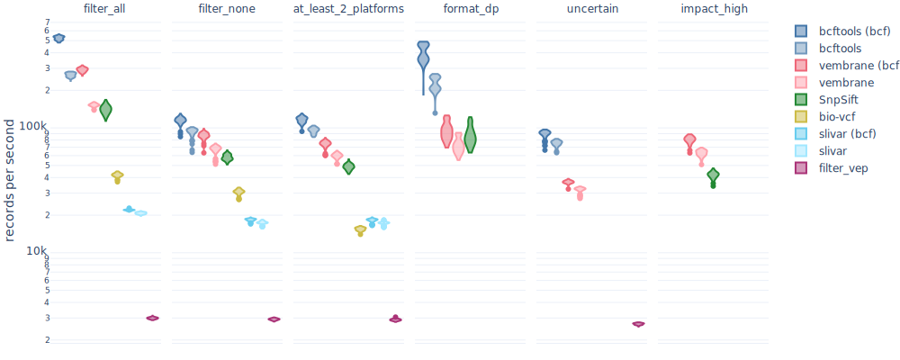

[](https://zenodo.org/badge/latestdoi/305723104)

# vembrane-benchmark
This is a snakemake workflow for benchmarking different VCF filtering tools.
It makes use of [GIAB](https://www.nist.gov/programs-projects/genome-bottle) samples `HG001`, `HG002`, `HG003` and `HG004` (see [Data sources](#data) below), [restricted to chromosome 1](https://github.com/vembrane/vembrane-benchmark/blob/503a49b46f78b5c0b2515bd6a3979b16dcbe01ba/workflow/rules/download.smk#L127-L139), [normalised with `bcftools norm -N -m-any`](https://github.com/vembrane/vembrane-benchmark/blob/503a49b46f78b5c0b2515bd6a3979b16dcbe01ba/workflow/rules/download.smk#L112-L124) and [annotated](https://github.com/vembrane/vembrane-benchmark/blob/v1.0.0/workflow/rules/annotation.smk) with [SnpEff](https://pcingola.github.io/SnpEff/se_introduction/) and [VEP](https://ensembl.org/info/docs/tools/vep/index.html).




## Usage
Either follow the [instructions in the snakemake workflows catalog](https://snakemake.github.io/snakemake-workflow-catalog?usage=vembrane/vembrane-benchmark) or clone this repository and run [snakemake](https://snakemake.github.io/):
```sh
git clone https://github.com/vembrane/vembrane-benchmark.git
cd vembrane-benchmark
snakemake --use-conda
```

### Configuration
By editing the [`config/config.yaml`](config/config.yaml) file, you can easily adjust or extend the `benchmark`.
With the `repeats` keyword, you can adjust the number of repeats run per combination of `filetypes` and scenarios (any of the scenarios under `annotations`) for each of the specified `tool`s.
By adding to any of these levels, you can extend the benchmark.
When adding filter scenarios and filetypes, please make sure that the respective tool can handle them.
When adding a new tool, you also need to provide an `invocation` entry in the configuration file and a corresponding conda environment definition file in [`workflow/envs/`](workflow/envs).
This file needs to be named exactly like the tool name you used in the [`config/config.yaml`](config/config.yaml) definition, i.e. `<tool_name>.yml`.

For example, the entry for vembrane looks like this:
 ```yaml
# The tool's name
vembrane:

  # Filter scenarios are divided by annotation source
  # which at the moment can only be snpEff or VEP.
  annotations:
    vep:
      filter_all: 'False'
      filter_none: 'True'
      at_least_2_platforms: 'INFO["platforms"] >= 2'
      format_dp: 'any(FORMAT["DP"][s] > 1250 for s in SAMPLES if "DP" in FORMAT)'
      uncertain: '"uncertain_significance" in ANN["CLIN_SIG"] or not (ID and ID.startswith("rs"))'
    snpeff:
      impact_high: 'ANN["Annotation_Impact"] == "HIGH"'

  # Supported input filetypes
  filetypes:
    - "bcf_b"  # compressed BCF
    - "vcf_v"  # plaintext VCF

  # The tool's CLI invocation pattern,
  # where `$FILTER` is a template variable
  # which is replaced by the filter scenario
  # expressions defined above.
  # The input filename will be appended.
  #
  # For example, for scenario `at_least_2_platforms`,
  # this will expand to:
  # `vembrane filter 'INFO["platforms"] >= 2' input.vcf`
  invocation: vembrane filter '$FILTER'
```

## Sources

### Data
| GIAB sample | FTP download link |
| ----------- | ----------------- |
| `HG001`     | [ftp://ftp-trace.ncbi.nlm.nih.gov/giab/ftp/release/NA12878_HG001/latest/GRCh38/HG001_GRCh38_GIAB_highconf_CG-IllFB-IllGATKHC-Ion-10X-SOLID_CHROM1-X_v.3.3.2_highconf_PGandRTGphasetransfer.vcf.gz](https://ftp-trace.ncbi.nlm.nih.gov/giab/ftp/release/NA12878_HG001/latest/GRCh38/) |
| `HG002`     | [ftp://ftp-trace.ncbi.nlm.nih.gov/giab/ftp/release/AshkenazimTrio/HG002_NA24385_son/latest/GRCh38/HG002_GRCh38_1_22_v4.1_draft_benchmark.vcf.gz](https://ftp-trace.ncbi.nlm.nih.gov/giab/ftp/release/AshkenazimTrio/HG002_NA24385_son/latest/GRCh38/) |
| `HG003`     | [ftp://ftp-trace.ncbi.nlm.nih.gov/giab/ftp/release/AshkenazimTrio/HG003_NA24149_father/latest/GRCh38/HG003_GRCh38_GIAB_highconf_CG-Illfb-IllsentieonHC-Ion-10XsentieonHC_CHROM1-22_v.3.3.2_highconf.vcf.gz](https://ftp-trace.ncbi.nlm.nih.gov/giab/ftp/release/AshkenazimTrio/HG003_NA24149_father/latest/GRCh38/) |
| `HG004`     | [ftp://ftp-trace.ncbi.nlm.nih.gov/giab/ftp/release/AshkenazimTrio/HG004_NA24143_mother/latest/GRCh38/HG004_GRCh38_GIAB_highconf_CG-Illfb-IllsentieonHC-Ion-10XsentieonHC_CHROM1-22_v.3.3.2_highconf.vcf.gz](https://ftp-trace.ncbi.nlm.nih.gov/giab/ftp/release/AshkenazimTrio/HG004_NA24143_mother/latest/GRCh38/) |


### Tools
At the moment, the following tools are considered:
 - [`vembrane`](http://github.com/vembrane/vembrane) (v0.10.1)
 - [`bcftools`](https://samtools.github.io/bcftools/bcftools.html#expressions) (v1.15.1)
 - [`SnpSift`](https://pcingola.github.io/SnpEff/ss_introduction/) (v5.1)
 - [`filter_vep`](https://www.ensembl.org/info/docs/tools/vep/script/vep_filter.html) (v107.0)
 - [`slivar`](https://github.com/brentp/slivar) (v0.2.7)
 - [`bio-vcf`](https://github.com/vcflib/bio-vcf) (v0.9.5)
